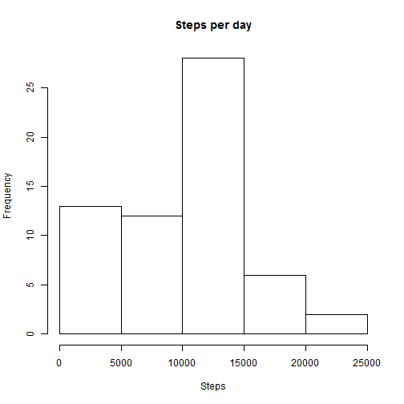
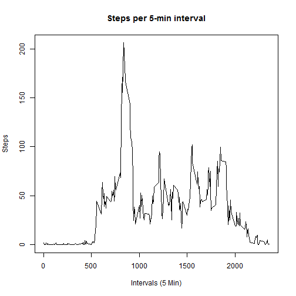
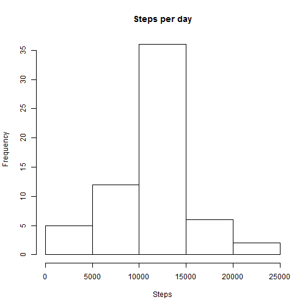

# Reproducible Research: Peer Assessment 1

## Loading and preprocessing the data
1. Load the data (i.e. read.csv())

```r
data <- read.csv("repdata-data-activity/activity.csv")
```

## What is mean total number of steps taken per day?
1. Make a histogram of the total number of steps taken each day

```r
meanSteps <- aggregate(data$steps,by=list(data$date),FUN=sum,na.rm=TRUE)
colnames(meanSteps)<-c("date","numSteps")

#Hist
hist(meanSteps$numSteps, xlab="Steps", main="Steps per day")
```

 

2. Calculate and report the mean and median total number of steps taken per day

```r
mean(meanSteps$numSteps)
```

```
## [1] 9354
```

```r
median(meanSteps$numSteps)
```

```
## [1] 10395
```

## What is the average daily activity pattern?

1. Make a time series plot (i.e. type = "l") of the 5-minute interval (x-axis) and the average number of steps taken, averaged across all days (y-axis)

```r
intervalSteps<-aggregate(data$steps,by=list(data$interval),FUN=mean,na.rm=TRUE)
colnames(intervalSteps)<-c("interval","numSteps")

#Plot
plot(intervalSteps$interval,intervalSteps$numSteps,type="l",xlab="Intervals (5 Min)",ylab="Steps",main="Steps per 5-min interval")
```

 

2. Which 5-minute interval, on average across all the days in the dataset, contains the maximum number of steps?

```r
intervalSteps$interval[which.max(intervalSteps$numSteps)]
```

```
## [1] 835
```

## Imputing missing values
1. Calculate and report the total number of missing values in the dataset (i.e. the total number of rows with NAs)

```r
numNA <- sum(is.na(data$steps)) 
```

2 & 3. Devise a strategy for filling in all of the missing values in the dataset. The strategy does not need to be sophisticated. For example, you could use the mean/median for that day, or the mean for that 5-minute interval, etc. Create a new dataset that is equal to the original dataset but with the missing data filled in.

```r
#Loop all data
newData <- data
for(i in 1:nrow(newData)){
  #Check if value is NA
  if(is.na(newData[i,1])){
    #Replace value with interval time
    newData[i,1]=intervalSteps[intervalSteps$interval==data[i,3],2]
  }
}
```

4. Make a histogram of the total number of steps taken each day and Calculate and report the mean and median total number of steps taken per day. Do these values differ from the estimates from the first part of the assignment? What is the impact of imputing missing data on the estimates of the total daily number of steps?

```r
newMeanSteps <- aggregate(newData$steps,by=list(newData$date),FUN=sum,na.rm=TRUE)
colnames(newMeanSteps)<-c("date","numSteps")

#Hist
hist(newMeanSteps$numSteps, xlab="Steps", main="Steps per day")
```

 

```r
mean(newMeanSteps$numSteps)
```

```
## [1] 10766
```

```r
median(newMeanSteps$numSteps)
```

```
## [1] 10766
```

As shown, imputing the missing data has shifted the data into a more normal distribution. This has created a higher mean/median steps per day.


## Are there differences in activity patterns between weekdays and weekends?
1. Create a new factor variable in the dataset with two levels - "weekday" and "weekend" indicating whether a given date is a weekday or weekend day.


```r
newData$DOW<-weekdays(as.Date(newData$date))
weekend<-c("Saturday","Sunday")
#Place types based on day of week
newData$dayType<-ifelse(newData$DOW %in% weekend, "weekend", "weekday")
newData$dayType<-factor(newData$dayType)
```

2. Make a panel plot containing a time series plot (i.e. type = "l") of the 5-minute interval (x-axis) and the average number of steps taken, averaged across all weekday days or weekend days (y-axis). The plot should look something like the following, which was creating using simulated data:


```r
dayTypeMeans<-aggregate(newData$steps,by=list(newData$interval,newData$dayType),FUN=mean)
colnames(dayTypeMeans)<-c("interval","dayType","steps")

#Hist
library(lattice)
xyplot(dayTypeMeans$steps ~ dayTypeMeans$interval|dayTypeMeans$dayType,dayTypeMeans,type="l",layout=c(1,2),xlab="Interval",ylab="Number of steps")
```

 
